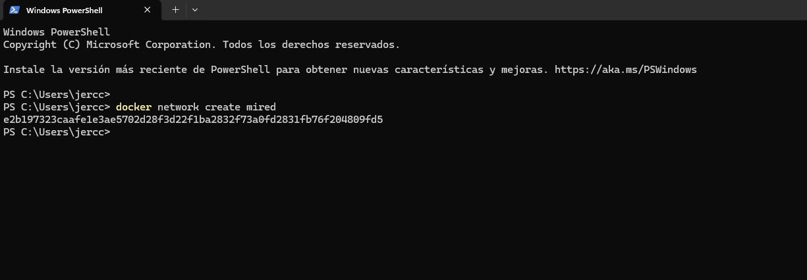
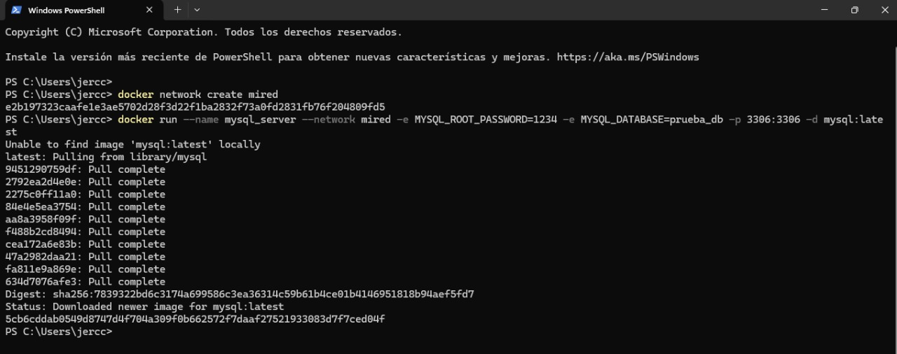

# TENDENCIAS TECNOLOGICAS

## 1. Titulo
ARQUITECTURA DE MICROSERVICIOS PARA LA APLICACIÓN DE AGENDAMIENTO DE CITAS EN UN SPA
## 2. Integrantes
Mateo Gabriel Campo
Mayra Alejandra Medranda

## 3.  Introducción

Los sistemas monolíticos presentan limitaciones en cuanto a escalabilidad, mantenibilidad y tolerancia a fallos. En este proyecto práctico se puede observar la migración del sistema de agendamiento de citas de un centro de spa desde una arquitectura monolítica hacia una arquitectura de microservicios.

Esta funcionalidad busca mejorar la escalabilidad, la flexibilidad, el mantenimiento y la disponibilidad del sistema, lo que permitirá un desarrollo y despliegue independiente de funcionalidades clave, mejorando la eficiencia del sistema.

## 4. Objetivos

-Aplicar los conceptos de arquitectura de microservicios a un proyecto práctico, 
-Abordar la separación de responsabilidades, despliegue independiente y uso de componentes clave como el servicio descubridor (Eureka) y el API Gateway.
-Aplicar herramientas de descubrimiento de servicios y punto de acceso único en una arquitectura de microservicios con el fin de facilitar la comunicación dinámica y centralizada entre múltiples servicios distribuidos.

## 5. Selección de funcionalidades 

Para el proyecto se  han seleccionado las siguientes funcionalidades para ser desacopladas como microservicios independientes:

- Gestor de Usuarios: Registro, inicio de sesión, autenticación y recuperación de contraseña.
- Gestor de citas: Agendamiento, modificación, cancelación, consulta y estado de citas.
- Gestor de Servicios del SPA: Visualización del catálogo de servicios disponibles.
- Servicio de Notificaciones: Envío de correos y mensajes por WhatsApp para confirmaciones y recordatorios.

## 6. Diseño Modular

Tabla 1. 
Microservicio
Descripción
Tecnología
Base de Datos
API REST
user-service
Registro, login, auth, autenticación JWT
Spring Boot, JW, Node.js
Usuario: id, name,email, contraseña
POST / register
  POST/ login
POST/ profile
appointment-
service
Gestión de servicios ofrecidos,
disponibilidad y a agendamiento de citas
Spring Boot
Citas: id,usuario_i,service_id, fecha,estado
GET /appointments
POST /appointments
PUT /appointments/{id}
DELETE/ appointments/{id}
service-
catálogo
Catálogo de servicios
FastAPI
PostgreSQL
/api/services, /api/services/{id}  /reschedule
notification-service
Notificaciones por correo y WhatsApp
Node.js + Twilio + Nodemailer
No aplica
/notify/email, /notify/whatsapp

## 7. Material de apoyo.

- Documentacion oficial de docker.
- Documentación oficial de MySQL.
- Documentación oficial de phpMyAdmin.
- Guia de la asignatura.

## 8. Procedimiento

## Parte 1: Crear dos contenedores: uno para MySQL y otro para phpMyAdmin, y establecer una red que permita la comunicación entre ambos.

### Paso 1:Crear un contenedor para MySQL, definiendo las credenciales necesarias.
Luego crear una red personalizada llamada mired para permitir la comunicación entre los contenedores: 

- docker network create mired

Crear el contenedor de MySQL, especificando la contraseña del usuario root y una base de datos de prueba: docker run --name mysql_server --network mired -e MYSQL_ROOT_PASSWORD=1234 -e MYSQL_DATABASE=prueba_db -p 3306:3306 -d mysql:latest
Tomemos en cuenta que:
- --name mysql_server: le pone de nombre mysql_server al contenedor.
- --network mired: conecta este contenedor a la red que se creo.
- -e MYSQL_ROOT_PASSWORD=1234: establece que la contraseña de root será 1234.
- -e MYSQL_DATABASE=prueba_db: crea una base de datos llamada prueba_db.
- -p 3306:3306: expone el puerto de MySQL para que se pueda usarlo.
- -d mysql:latest: usa la última versión de MySQL.

### Paso 2: Crear un contenedor para phpMyAdmin, configurando las credenciales.

Crear el contenedor para phpMyAdmin: 
docker run --name phpmyadmin_server --network mired -e PMA_HOST=mysql_server -p 8080:80 -d phpmyadmin/phpmyadmin
Tomemos en cuenta que:
- --name phpmyadmin_server: nombra al contenedor phpmyadmin_server.
- --network mired: lo conecta a la red mired.
- -e PMA_HOST=mysql_server: dice que el servidor de base de datos es el contenedor mysql_server.
- -p 8080:80: hace que phpMyAdmin esté accesible en el navegador entrando a localhost:8080.

### Paso 3: Crear una red personalizada en Docker que permita la comunicación entre ambos contenedores.

Crear el contenedor de phpMyAdmin y conectarlo a la misma red, indicando el servidor de MySQL: docker run --name phpmyadmin_server --network mired -e PMA_HOST=mysql_server -p 8080:80 -d phpmyadmin/phpmyadmin
Tomemos en cuenta que:
- PMA_HOST=mysql_server establece el contenedor de MySQL como host.
- -p 8080:80 expone phpMyAdmin en el puerto 8080 de la máquina local.

### Paso 4: Conectar ambos contenedores a la red creada.

Al crear los contenedores usando el parámetro --network mired, ambos ya están conectados automáticamente a la misma red. Esto permite visualizar los detalles de la red mired.

### Paso 5: Configurar la conexión entre phpMyAdmin y MySQL, y crear una base de datos de prueba desde la interfaz de phpMyAdmin.

Abrir un navegador web y acceder a http://localhost:8080.
En la pantalla de inicio de phpMyAdmin, conectarse usando:
- Servidor: mysql_server
- Usuario: root
- Contraseña: 1234
Una vez dentro de phpMyAdmin, verificar que prueba_db se haya creado correctamente.
Crear una tabla de prueba para confirmar que la conexión entre phpMyAdmin y MySQL funciona correctamente.

## 9. Resultados esperados:

- Contenedores conectados correctamente mediante la red personalizada mired.
- Acceso exitoso a MySQL mediante phpMyAdmin usando la IP de red interna.
- Creación de bases de datos y tablas usando phpMyAdmin.
- Se fortalecen los conocimientos en creación de redes, administración de contenedores y gestión básica de bases de datos.

## 10. Bibliografía

- Docker Inc. (2024). Docker Documentation. Recuperado de: https://docs.docker.com

- MySQL Documentation Team. (2024). MySQL 8.0 Reference Manual. Recuperado de: https://dev.mysql.com/doc/

- phpMyAdmin. (2024). phpMyAdmin Documentation. Recuperado de: https://docs.phpmyadmin.net/ 

- Nickoloff, J., & Kuenzli, S. (2019). Docker in Action. Simon and Schuster.

- Miell, I., & Sayers, A. (2019). Docker in Practice. Simon and Schuster.

